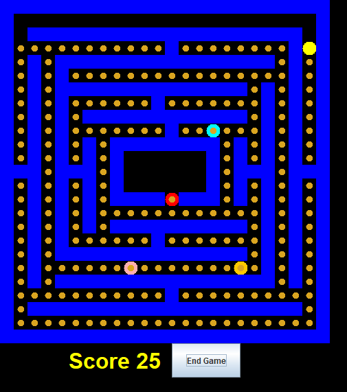

<<<<<<< HEAD
# Project 1: PacMan #
## **Team 9**

## 1. Group Members
Sarah Bang, Anjali Sharma, Rongjing Li, Zeeshan Shaikh


## 2. Image of Our Code Playing PacMan



## 3. The Code from the Command Line (How to Run)
To run the code, please input these directions onto the command line:
```bash
javac -cp "src/" src/*.java
java -cp "src/" StartMenu
```
Make sure you are on the project root folder/directory when running the commands.
Running these commands should open the JFrame and allow you to play Automonous PacMan.

b) Test the code by running JUnit
```bash
javac -cp "tests/junit-4.10.jar:src/:tests/" src/*.java tests/*.java
java -cp "tests/junit-4.10.jar:src/:tests/" org.junit.runner.JUnitCore your_test_here
ex: java -cp "tests/junit-4.10.jar:src/:tests/" org.junit.runner.JUnitCore TestGhostMove
```

## 4. List of the Functions We Wrote
This section contains all of the functions our team wrote and implemented.

### PacMan Class
The PacMan Class implements the functionality of the PacMan component in the game.

#### move()
- **Type:** `() -> Bool`
- **Description:** Moves the Pacman component by calling the myMap object's move() method.
- **Test:** Tested pacman not being able to move in an enclosed space, then being able to
move in a corridor.

#### consume()
- **Type:** `() -> JComponent`
- **Method Description:** This method checks to see if there is a 'power-cookie' located in Pacman's current coordinate. If there is, this method calls the eatCookie method from the Map Class, and returns the cookie component if the cookie a consumed, and null otherwise.
- **Test Description:** This test uses JUnit Assert API to test if the consume method in PacMan class is functional. It created a new frame and pacman object, setted the inital position to (0, 0). According to Map.txt, there is a wall, so the pacman can't do anything with cookies anyway, and the method should return null if the method works.

#### get_valid_moves()
- **Type:** `() -> ArrayList`
- **Method Description:** This method returns all the valid moves that PacMan can make given his current position. Invalid moves include walls and out of bounds.
- **Test Description:** Tested with JUnit Assert API to check if the result contains the correct valid moves in multiple locations.

#### is_ghost_in_range()
- **Type**: `() -> Bool`
- **Method Description:**: This method checks its surroundings to see if any Ghosts are in attack range. The attack radius of a ghost is 1 in respect to their x and y coordinates. If any Ghosts are in the attack range, this method returns true otherwise it returns false.
- **Test Description:**: Tested a ghost at (1,2) and pacman at (1,1), therefore it is true that there is a ghost in range since they are 1 apart.


### Ghost Class
The Ghost Class implements the functionality of the Ghost component in the game.

#### move()
- **Type:** `() -> Bool`
- **Description:** Moves the Ghost component by calling the myMap object's move() method.
- **Test:** Tested a red ghost not being able to move in an enclosed space, then being able to
move in a corridor.

#### get_valid_moves()
- **Type:** `() -> ArrayList`
- **Method Description:** This method returns all the valid moves that a Ghost can make given its current position. Invalid moves include walls and out of bounds.
- **Test Description:** Tested with JUnit Assert API to check if the result contains the correct valid moves in multiple locations.

#### is_pacman_in_range()

- **Type**: `() -> Bool`
- **Method Description**: This method checks its surroundings to see if any Pacmans are in attack range. The attack radius of a pacman is 1 in respect to their x and y coordinates . If any Pacman are in the attack range, this method returns true otherwise it returns false.
- **Test Description**: Tested a ghost at (1,2) and pacman at (1,1), therefore it is true that there is a pacman in range since they are 1 apart.

#### attack()

- **Type**: `() -> Bool`
- **Method Description**: This method returns true if the the is_pacman_in_range() function returns true. this means that the ghost can attack, and was successful. 
- **Test Description**: Tested a ghost at (1,2) and pacman at (1,1), therefore it is true that there is a ghost in range since they are 1 apart. This means that is_pacman_in_range() returns true, and attack() will return true as well. 


### Map Class
The Map Class uses Java GUI to create the visual represenation of our game.

#### move(String name, Location loc, Type type)
- **Type:** `(String name, Location loc, Type type) -> Bool`
- **Description:** Takes the name, location, and type of a component and moves it to the specified location.
- **Test:** Tested if a pacman and ghost can move, but cookies should not move.

#### attack(String name)
- **Type:** `(String name) -> Bool`
- **Method Description:** The method controls ghosts attacking pacman. If the ghost was able to successfully attack pacman and update the display to do so return true, otherwise return false.
- **Test Description:** This test uses JUnit Assert API to test if the attack method in Map class is functional. It created a new frame, pacman, and ghost object, setted the inital position to (0, 0). According to Map.txt, there is a wall, so there won't be any attack happens, and the method should return null if the method works. And then the pacman shifts to (1, 1), at this point, the method should not return null.

#### eatCookie(String Name)
- **Type:** `() -> JComponent`
- **Method Description:** The method controls Pacman eating a cookie. When the function is able to successfully update display to eat a cookie it returns the Cookie component that has been eaten, otherwise it returns null.
- **Test Description:** This test uses JUnit Assert API to test if the eatCookie method in Map class is functional. It created a new frame and pacman object, setted the inital position to (0, 0). According to Map.txt, there is a wall, so the pacman can't eat cookie, and the method should return null if the method works. And then the pacman shifts to (1, 1), at this point, the method should not return null.

#### getLoc(Location loc)
- **Type:** `(Location loc) -> HashSet<Type>`
- **Method Description:** For the given location argument, this method returns what is currently at the location (Empty, Pacman, Cookie, Ghost, Wall).
- **Test Description:** Tested with JUnit Assert API to check if the result contains the correct Types.


-----
Sources: CMSC388T - University of Maryland, College Park
-----
=======
# Project 1: PacMan
Due: 01/11, 11:59pm EDT (Late 01/12, 11:59pm)

## Before You Start

Make sure you have completed Project 0 and set up your local environment. Your project manager should have set up a repository for you and your team to complete. Make sure you are working with that repository.

## Introduction

In this project, you will be working in a team to develop the code for an Automonous PacMan. There are 4 parts to this project:

1. Code Development
2. Testing
3. Code Review
4. README

Each part has been created to be evenly distributed among your team. 

### Submitting

Once you complete each feature, you will submit a pull request from your feature to the main branch. Assign your project manager as a reviewer to this pull request and they will grade your work. Make sure to assign any pull requests from feature items to feature branches to your assigned cards. We will use this to grade your individual contributions. 

## Part 1
In this part of the project, you will develop code collaboratively with your team. There are three features that you will be working on:

* FTR-pacman
* FTR-ghost
* FTR-map

For each feature, a template java file has been provided that you will be filling out with your team.

Each feature can be divided evenly among your group and each member should create their own feature-item branch off of the feature branch. For example, if you are working on the PacMan class and have chosen to work on the get_valid_moves function, you should make a branch from FTR-pacman with the name pacman-get_valid_moves. By the end of this section, you should have 12 feature item branches and 3 feature branches with your code. 

Once this part has been completed, you should be able to see a JFrame appear that allows you to play Automonous PacMan by compiling and running your files:

```bash
javac -cp "src/" src/*.java
java -cp "src/" StartMenu
```

Make sure to run these commands from inside the P1 directory

- **javac** - compiles all of the source files
- **java** - runs the StartMenu java program
- **-cp** - specifies the classpaths

## Part 1a: PacMan Class
  
### get_valid_moves()

- **Type**: `() -> ArrayList`
- **Description**: This method returns all the valid moves that PacMan can make given his current position.
- **Examples**:
  ```java
  //pacman at location (9,11)
  pacman.get_valid_moves() -> {(9,12), (10,11), (10,12)}
  ```
  
### move()

- **Type**: `() -> Bool`
- **Description**: This method uses the get_valid_moves method to find the possible locations that PacMan can move, given his current location. The method then  chooses to move in one of those directions. You are free to apply an algorithm here if you would like, but the only requirement is that you move in a valid direction. If PacMan is able to move, this function returns true otherwise it returns false.
- **Examples**:
  ```java
  //pacman at location (9,11)
  pacman.move() -> true
  pacman.myLoc ∈ {(9,12), (10,11), (10,12)}
  ```
  
### is_ghost_in_range()

- **Type**: `() -> Bool`
- **Description**: This method checks its surroundings to see if any Ghosts are in attack range. The attack radius of a ghost is 1 which means that a ghost at location   can attack PacMan as long as PacMan is located at . If any Ghosts are in the attack range, this method returns true otherwise it returns false.

- **Examples**:
  ```java
  //ghost at location (9,11)
  //pacman at location (9,12)
  pacman.is_ghost_in_range() -> true
  ```
  
### consume()

- **Type**: `() -> JComponent`
- **Description**: This method checks to see if there is a 'power-cookie' located in Pacman's current   coordinate. If there is, this method calls the eatCookie method from the Map Class, and returns the cookie component if the cookie a consumed, and null otherwise.
- **Examples**:
```java
//pacman at location (9,12)
//cookie NOT at location (9,12)
pacman.consume() -> null
```


## Part 1b: Ghost Class

In this section, you must create a class for the ghosts that are moving around the map. The class and constructor are given to you in the Ghost.java file. Each team member should choose one of the following functions to complete and create a feature-item branch off of the FTR-ghost feature branch. 

### get_valid_moves()

- **Type**: `() -> ArrayList<Location>`
- **Description**: This function returns an arraylist of possible locations that a ghost can move to from its current location. Ghosts cannot move through walls, but they can move through other ghosts or PacMan.
- **Examples**:
  ```java
  //ghost at location (9,11)
  ghost.get_valid_moves() -> {(9,12), (10,11), (10,12)}
  ```
  
### move()

- **Type**: `() -> Bool`
- **Description**: This function uses the get_valid_moves function to find the possible locations that a ghost can move to from its current location and chooses to move in one of those directions. You are free to apply an algorithm here if you would like, but the only requirement is that you move in a valid direction. If the ghost is able to move, this function returns true otherwise it returns false.

- **Examples**:
  ```java
  //ghost at location (9,11)
  ghost.move() -> true
  ghost.myLoc ∈ {(9,12), (10,11), (10,12)}
  ```
  
### is_pacman_in_range()

- **Type**: `() -> Bool`
- **Description**: This function checks its surroundings to see if PacMan is in attack range. The attack radius of a ghost is 1 which means that a ghost at location   can attack PacMan as long as PacMan is located at . If PacMan is in the attack range, this function returns true otherwise it returns false.

- **Examples**:
  ```java
  //ghost at location (9,11)
  //pacman at location (9,12)
  ghost.is_pacman_in_range() -> true
  ```
  
### attack()

- **Type**: `() -> Bool`
- **Description**: This function checks to see if PacMan is in the attack range by using the is_pacman_in_range method and attacks PacMan if it is in range. This function returns true if the attack was successful and false otherwise.

- **Examples**:
  ```java
  //ghost at location (9,11)
  //pacman at location (9,12)
  ghost.attack() -> true
  ```

## Map Class

The Map Class uses Java GUI to create the visual represenation of our game. For this project, we have given you most the code for the GUI with the exception of 4 methods which you will have to write. The goal of this section is to develop the interaction between pacman and walls and cookies as well as attacking ghosts. 
### move(String name, Location loc, Type type)

- **Type**: `(String name, Location loc, Type type) -> Bool`
- **Description**: The method takes a name, location, and type and put the object specified by the name at the location. If the function is able to successfull move the object it returns true, otherwise it returns false.
- **Examples**:
  ```java
  //pacman at location (2,4)
  map.move("pacman", new Location (2,4), Map.Type.PACMAN) -> true
  ```
### getLoc(Location loc)

- **Type**: `(Location loc) -> HashSet<Type>`
- **Description**: For the given location argument, returns what is currently at the location (Empty, Pacman, Cookie, Ghost, Wall).

 ```java
  //pacman at location (2,4)
  map.getLoc(new Location (2,4) -> Map.Type.PACMAN
  ```

### attack(String name)
- **Type**: `(String name) -> Bool`
- **Description**: The method controls ghosts attacking pacman. If the ghost was able to successfully attack pacman and update the display to do so return true, otherwise return false.

 ```java
  //ghost named clyde at location (9,11)
  //pacman at location (9,12)
  Map.attack("clyde") -> true
  ```


### eatCookie(String Name)
- **Type**: `() -> JComponent`
- **Description**: The method controls Pacman eating a cookie. When the function is able to successfully update display to eat a cookie it returns the Cookie component that has been eaten, otherwise it returns null.

 ```java
  //cookie NOT at location (4,6)
  //pacman at location (4,6)
  Map.eatCookie("pacman") -> null
  ```

## Part 2: Writing Tests

In this section, you will write tests for each of the feature-items you have worked on. For each class, there is a tests file that contains a template for writing JUnit tests in the tests folder. In each feature-item, write a JUnit test that checks to see if the function you wrote is working correctly. To complete this part,

* write a JUnit test for each function that you have completed
* add and commit each test you wrote to your feature-item branch
* **Run the test!** Make sure that your test passes when the code is correct 
* Make sure that you can break the code and that the test fails

We aren't necessarily looking for complete coverage with this section, but you are welcome to make your tests as robust as possible. It is important that your test passes when the code is correct and that you can modify your original code (to be incorrect) which will result in the test failing. **You will be using these tests in Project 2**.

**Important Notes**

When writing the tests, you may find some of the following commands useful:

```java
//Creating A Map 
Mainframe frame = new MainFrame(); //Creates A New Map With Walls and Tokens Initialized
NoFrame frame = new NoFrame(); //Creates A New Map With Walls and Tokens w/o a Display

//Creating Players
Ghost ghost = frame.addGhost(new Location(x, y), "name", Color.red); //Creates a red ghost named "name" at location x,y
PacMan pacman = frame.addPacMan(new Location(x, y)); //Creates PacMan at location x, y

//alternatively if you don't need the PacMan or Ghost objects in your tests
frame.initPlayers(); //Creates all of the players

//Start The Game
frame.startGame();
```

To compile your tests, run the following lines from the project directory in your command line:

```bash
javac -cp "tests/junit-4.10.jar:src/:tests/" src/*.java tests/*.java
java -cp "tests/junit-4.10.jar:src/:tests/" org.junit.runner.JUnitCore your_test_here
ex: java -cp "tests/junit-4.10.jar:src/:tests/" org.junit.runner.JUnitCore TestGhostMove
```

## Part 3: Code Review

For this part of the project, each team member must submit a pull request for each feature-item that they have worked on. To do this,

* Push each feature-item branch to your remote repository
* Create a pull request for each feature-item to merge them with their respective feature branches
* Assign yourself to the pull request
* Assign one of your team membes as a reviewer

Each team member must also review another team member's pull requests and

* Read through the changes and leave comments or request changes if needed
* Approve a pull request
* Complete the pull request by merging changes

To make it easier, you may want to have each team member review only one other team member's pull requests. This would gaurantee that everyone on the team will review the same number of pull requests.

## Part 4: Writing a README

For this section you will be creating your own project README with your group. Your README should have

* A title
* Your group members names
* An image of your code playing PacMan
* A section on how to run the code from the command line
  * include a code block
* A list of the functions you wrote with
  * a description of the implementation for each function 
  * a description of the test you wrote

The descriptions don't have to be long - a sentence or two would suffice.

Feel free to be creative and add any other elements. For example, you could

* add a video of your code playing PacMan instead of an image
* add small code blocks that supplement your descriptions
* add a table of contents for your readme

These aren't required, but could be interesting to explore. 

## Academic Integrity

Please **carefully read** the academic honesty section of the course syllabus. **Any evidence** of impermissible cooperation on projects, use of disallowed materials or resources, or unauthorized use of computer accounts, **will be** submitted to the Student Honor Council, which could result in an XF for the course, or suspension or expulsion from the University. Be sure you understand what you are and what you are not permitted to do in regards to academic integrity when it comes to project assignments. These policies apply to all students, and the Student Honor Council does not consider lack of knowledge of the policies to be a defense for violating them. Full information is found in the course syllabus, which you should review before starting.
>>>>>>> 257f8be095b59f133421fec0ae99ad0c6cc77c09
